# BasinsCollection

This code base is using the Julia Language and [DrWatson](https://juliadynamics.github.io/DrWatson.jl/stable/)
to make a reproducible scientific project named
> BasinsCollection

It is authored by Wagemakers.

To (locally) reproduce this project, do the following:

0. Download this code base. Notice that raw data are typically not included in the
   git-history and may need to be downloaded independently.
1. Open a Julia console and do:
   ```
   julia> using Pkg
   julia> Pkg.add(DrWatson) # install globally, for using `quickactivate`
   julia> Pkg.activate(path/to/this/project)
   julia> Pkg.instantiate()
   ```

This will install all necessary packages for you to be able to run the scripts and
everything should work out of the box, including correctly finding local paths.


# Content: 

* Basins for the Newton root finding algorithm

   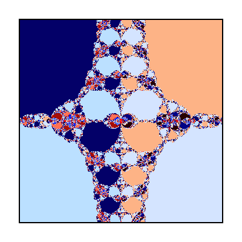

* Riddled basins `ott_basins.jl`: https://doi.org/10.1016/0167-2789(94)90047-7

   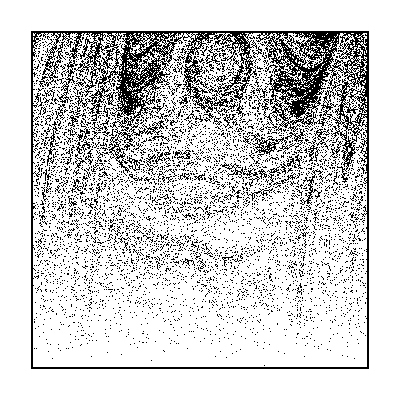

* Riddled Basins from `sommerer_basins.jl`: Sommerer, John C. "The end of classical determinism." Johns Hopkins APL Technical Digest 16.4 (1995): 333.
   
   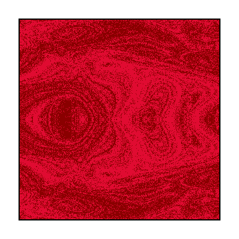

* Duffing oscillator basins `duffing_basins.jl`

   

* Forced pendulum basins `pendulum_basins.jl`

   

* Hénon map `map_henon.jl`: https://doi.org/10.1016/j.physrep.2014.02.007

   

* Henon Heiles open Hamiltonian escape basins `cuencas_hh.jl`

   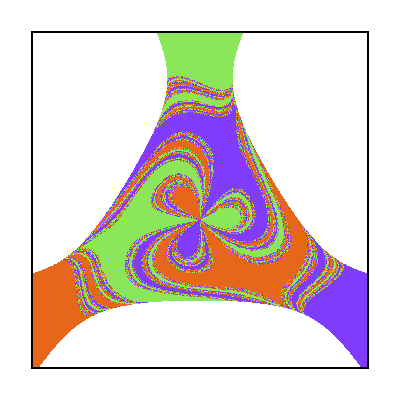

* 4D kicked map rotor (1998) `4d_kicked.jl`: https://doi.org/10.1016/S0960-0779(97)00058-1

   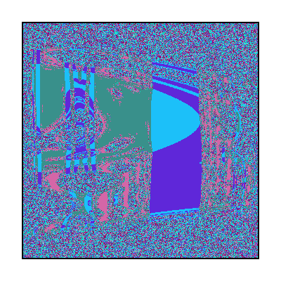

* A map with hundred of attractors: `kicked_rotor.jl`: https://doi.org/10.1103/PhysRevE.54.71

   

* 4D kicked map rotor from `kicked_ott.jl`: https://doi.org/10.1016/0167-2789(87)90108-4

   

* A map with Wada `map_feudel.jl`: https://doi.org/10.1103/PhysRevE.58.3060

   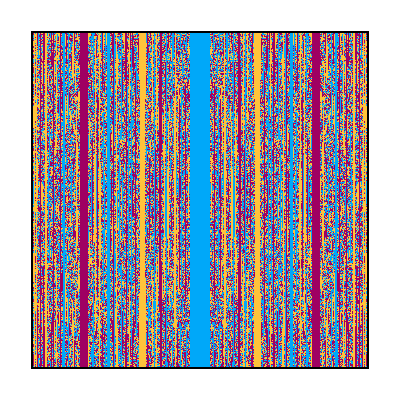

* Map with fractal boundary `map_grebogi.jl`: https://doi.org/10.1016/0375-9601(83)90945-3

   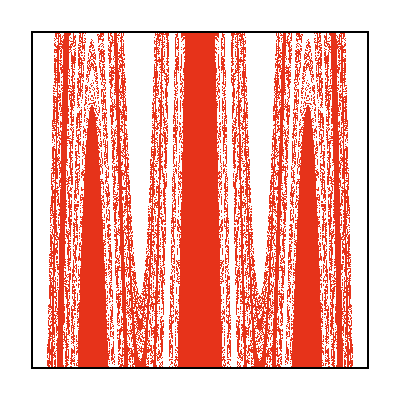

* Fractal boundary in the josephson junction `josephson_junction.jl`: https://doi.org/10.1103/PhysRevA.36.2455 

   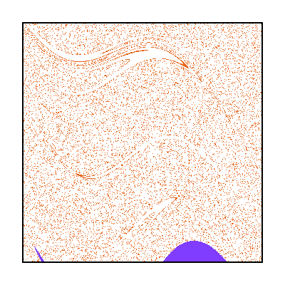

* Fractal Boundary from the magnetic pendulum `magnetic_pendulum.jl`: https://doi.org/10.1103/PhysRevLett.111.194101

   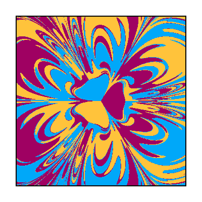

* Rikitake oscillator basins `rikitake.jl`, unpublished.

   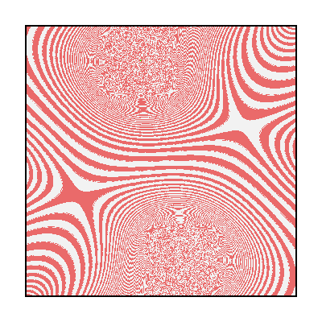

* Thomas cyclical oscillator basins `thomas.jl`, unpublished

   

* Kuramoto oscillators on the UK power grid `kur_halekotte.jl`: https://doi.org/10.1088/2632-072X/ac080f

   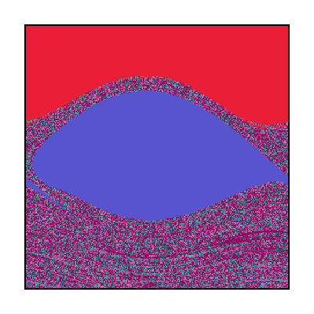

* Lorenz 84 system `lorenz84.jl`: https://doi.org/10.1063/1.2953589

   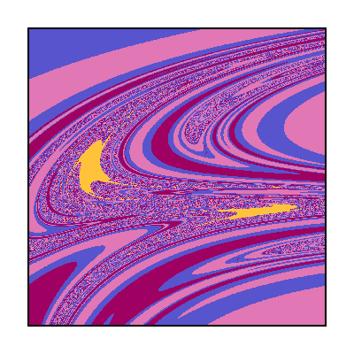

* Slim fractals `slim_fractals.jl`: https://doi.org/10.1103/PhysRevX.7.021040

   

* Sporadical map `sporadical_map.jl`: https://doi.org/10.1103/PhysRevLett.82.3597

   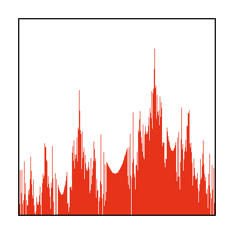

* Cold atoms `cold_atoms.jl`: https://doi.org/10.1103/PhysRevA.95.013629

   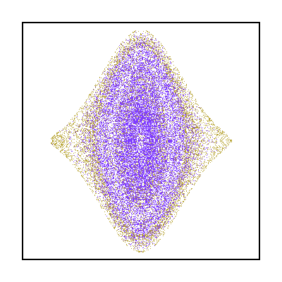

* Competition ecology plancton `competition_ecology_plancton.jl`: https://doi.org/10.1086/319929

   

* Open Sinai billiard `open_billiard_sinai.jl`: https://doi.org/10.1103/PhysRevA.38.930

   

* Aguirre billiard `aguirre_billiard.jl`: https://doi.org/10.1103/PhysRevE.67.056201

   

* Poon billiard `poon_billiard.jl`: https://doi.org/10.1142/S0218127496000035

   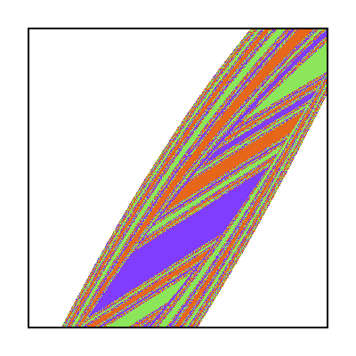

* Hidden attractors in Chua oscillators `hidden_chua.jl`: https://doi.org/10.1016/j.physleta.2011.04.037

   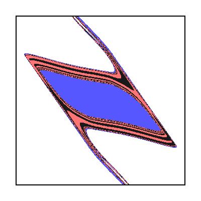

* Li Sprott oscillator `li_sprott.jl`: https://doi.org/10.1142/S0218127416502333 

   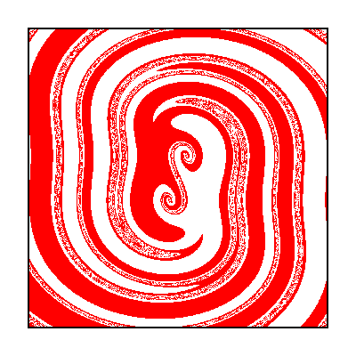

* Binary Black Holes escape basins `black_holes.jl`: https://doi.org/10.1103/PhysRevD.98.084050

   

* Discrete predator Prey system `predator_prey_discrete.jl`: https://doi.org/10.1016/j.chaos.2022.112833

   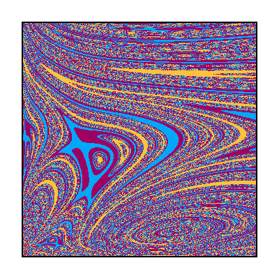

* Disipative nontwist map `dsnm.jl`: https://doi.org/10.1103/PhysRevE.107.024216

   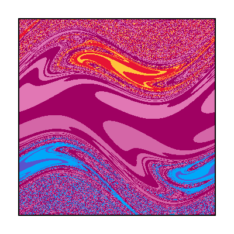

* 6D Shear Flow model `lebovitz_mariotti.jl`: https://doi.org/10.1017/jfm.2013.38

   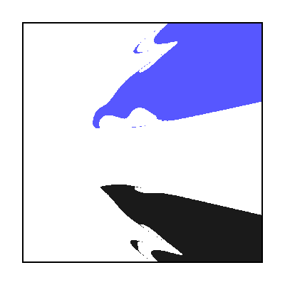

* 9D model of Fluid dynamics `eckhardt_9D.jl`: https://doi.org/10.1088/1367-2630/6/1/056 and https://doi.org/10.1103/PhysRevE.91.052903 (this last paper has a basins that I cannot reproduce)

   

* Wada basins in the cubic 2D map (`map_cbic.jl`): http://dx.doi.org/10.1016/j.physleta.2013.03.027
  
  

* Riddled basins of discrete 2D system `map_kapitaniak.jl`: https://doi.org/10.1103/PhysRevE.57.R6253

   

* Coupled logistic maps with riddled basins (Fig 15 of the paper has an error) `map_cpled_logstc.jl`:  https://doi.org/10.1103/PhysRevE.57.2713

   

* Sprott-memristor model `sprott_memristive.jl`: https://doi.org/10.1016/j.chaos.2022.111834

   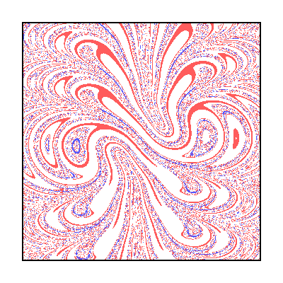

* Parametrically forced pendulum `para_pendulum.jl`: http://dx.doi.org/10.1142/S0218127411030167

   

* Bogdanov map `map_bogdanov.jl`:  https://doi.org/10.1142/S021812749300074X

   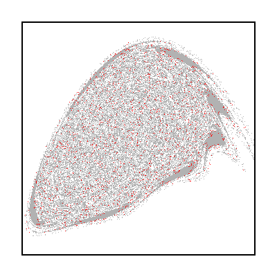

* Coupled Lorenz systems `coupled_lorenz.jl`:  https://doi.org/10.1103/PhysRevE.96.062203

   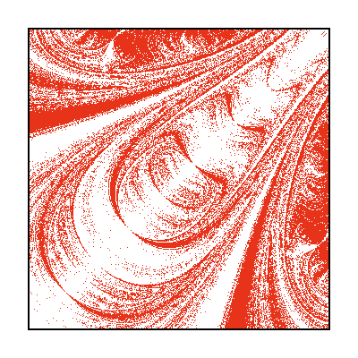

* Rock-Paper-Scisors competition model `cyclic_competition.j`:  https://doi.org/10.1063/1.5045366

   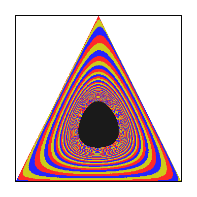

* Split Ring Resonator model `split_ring_resonator.jl`:  https://doi.org/10.1063/5.0157489

   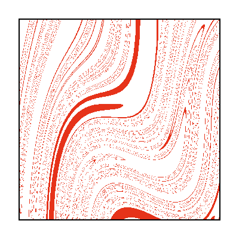

* Alfven Complexity `alfven_complexity.jl`: https://doi.org/10.1142/S0218127402005303

   

* Pump modulation erbium doped fiber laser  (basins are slightly different) `pumped_laser_dynamics.jl`: https://doi.org/10.1016/j.physleta.2009.10.061

   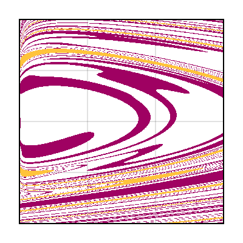

* CO2 modulated laser model (the basins in the paper are wrong due to numerical instabilities in the model) `co2_modulated_laser.jl`: https://doi.org/10.1063/5.0093727

   

* Threshold-Linear Networks with multistable patterns `TLNs_network.jl`: https://doi.org/10.1371/journal.pone.0264456 

   

* Basins with tentacles `kuramoto_basins_with_tentacles.jl`:  https://doi.org/10.1103/PhysRevLett.127.194101

   

* Riddled basins in coupled cuadratic map `map_ashwin.jl`: https://doi.org/10.1088/0951-7715/9/3/006

   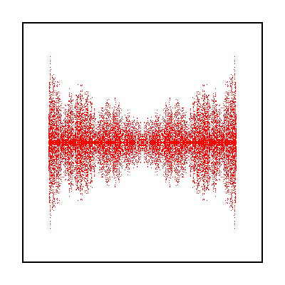

* Active Photonic Couplers `photonic_coupler.jl`: https://doi.org/10.1103/PhysRevA.100.043834

   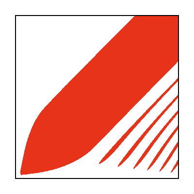

* Multistable Chimera in reduced Kuramoto model (two coupled populations) `chimera_reduced_model.jl`: https://doi.org/10.1088/1367-2630/18/2/022002

   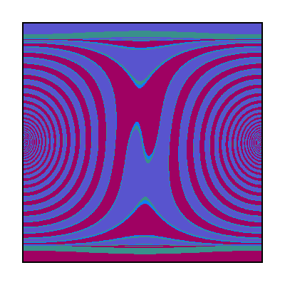

* Carpet oscillator `carpet_oscillator.jl`: https://doi.org/10.1007/s12043-018-1581-6

   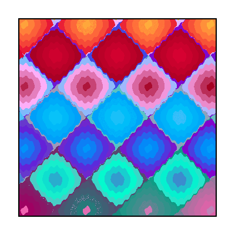

* Megastability: nested attractors: `megastability_sprott.jl`: https://doi.org/10.1140/epjst/e2017-70037-1

   

* Matryoshka multistability: `matryoshka.jl`: https://doi.org/10.1016/j.chaos.2024.115412

   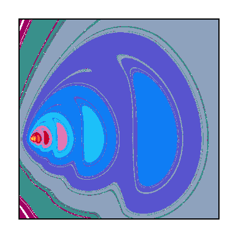

* Bairstow application: `map_bairstow.jl`: https://doi.org/10.1063/1.166158

   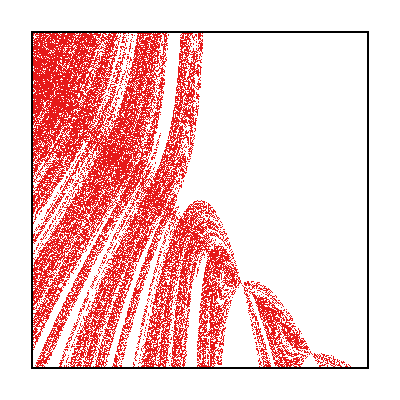

* Quadratic map for basin bifurcations: `map_mira.jl`: https://doi.org/10.1142/S0218127494000241

   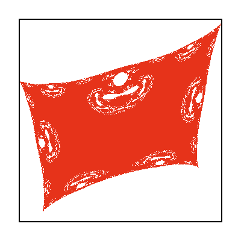

* Geographic Economic competition model: `economic_geographic_model.jl`: http://dx.doi.org/10.1016/j.matcom.2014.01.004

   

* Multistability in a dynamic Cournot game: `map_nash_eq.jl`: 

   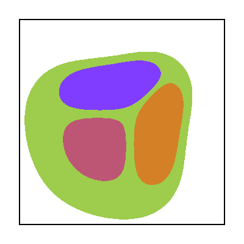

* Nonsmooth models of gear rattle oscilator: `gear_rattle.jl`: https://doi.org/10.1142/S021812740902283X

   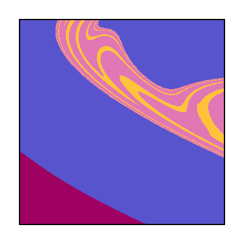

* Piecewise Smooth Dynamical System: `map_lai.jl`: https://doi.org/10.1063/1.2985853

   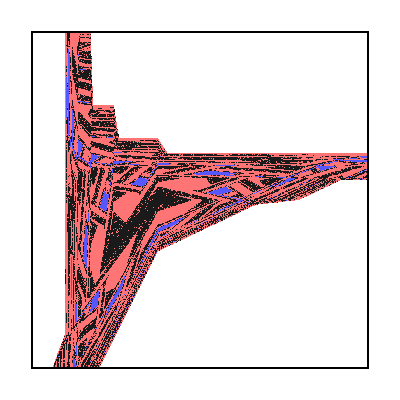

* Basin bifurcations in quasiperiodically forced coupled systems: `map_shrimali.jl`: https://doi.org/10.1103/PhysRevE.72.036215

   

* Basins of attraction in a gear ratlle oscillator: `gear_rattle_souza.jl`: https://doi.org/10.1177/107754630100700605 

   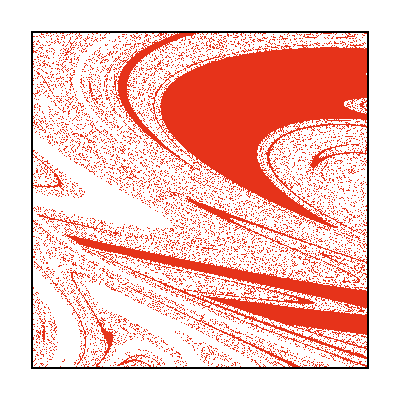

* Basins of attraction of different ringing schemes of the church bell: `bell_yoke2.jl`: https://doi.org/10.1016/j.ijimpeng.2015.06.008

   

* Basins of a multiply regulated biochemical system: `decroly_biorhythm.jl`: https://doi.org/10.1073/pnas.79.22.6917   

   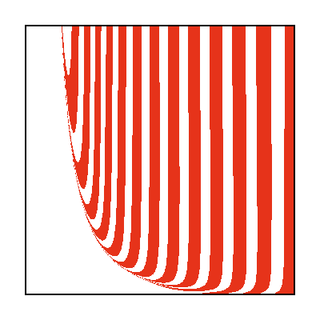

* Multistability in discrete chaotic systems using numerical integration with variable symmetry: `map_vcsd_chen.jl`: https://doi.org/10.1016/j.chaos.2022.112794

  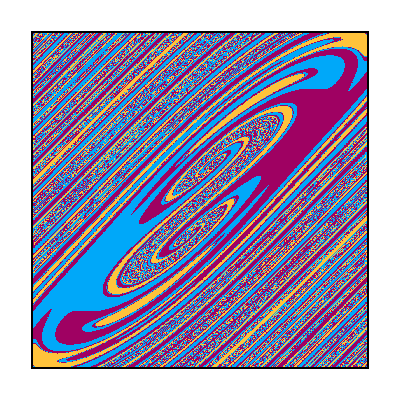

* Adaptive synapse-based neuron model with heterogeneous multistability and riddled basins: `neuron_synapse.jl`: https://doi.org/10.1063/5.0125611

   

* Grazing chaos in impacting system: `souza_impacting.jl`: https://doi.org/10.1016/j.chaos.2007.01.022

   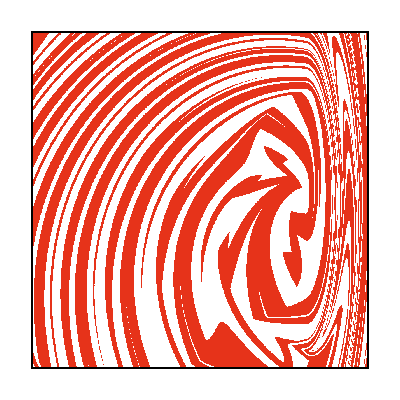

* Simplified discretized Lorenz model: `lorenz_computational_chaos.jl`:  https://doi.org/10.1016/0167-2789(89)90072-9

   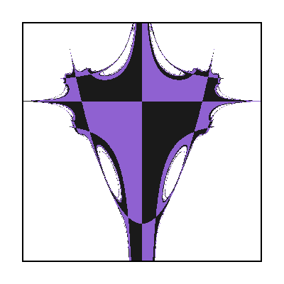

* Cournot economic game in 2D: `map_bischi_cournot.jl`: https://doi.org/10.1016/S0960-0779(98)00130-1


* Chaotic Gyrostat basins: `gyrostat.jl`: https://doi.org/10.3390/math10111914


